```{r setup, include=FALSE}
options(htmltools.dir.version = FALSE)
```

```{r xaringan-extra, echo = FALSE}
xaringanExtra::use_tile_view()

xaringanExtra::use_fit_screen()

xaringanExtra::use_extra_styles(
  hover_code_line = TRUE,         #<<
  mute_unhighlighted_code = TRUE  #<<
)

htmltools::tagList(
  xaringanExtra::use_clipboard(
    button_text = "<i class=\"fa fa-clipboard\"></i>",
    success_text = "<i class=\"fa fa-check\" style=\"color: #90BE6D\"></i>",
    error_text = "<i class=\"fa fa-times-circle\" style=\"color: #F94144\"></i>"
  ),
  rmarkdown::html_dependency_font_awesome()
)

```


```{r load-tidy, echo = FALSE, message = FALSE, warning = FALSE}
library(tidyverse)
library(flipbookr)
#knitr::opts_chunk$set(fig.width = 6, message = FALSE, 
#                      warning = FALSE, comment = "", 
#                      cache = F)
```

```{r,echo=F,eval=T,warning=F,message=F}
library(tidyverse)
library(corrplot)
library(factoextra)
library(foreign)
library(RColorBrewer)
options(ggrepel.max.overlaps = Inf)
library(matlab)
```

```{r, echo=FALSE}
# Scaling
scale <- function(x){(x-mean(x, na.rm = TRUE))/sd(x, na.rm = TRUE)}

# Correlation matrix
myCorr <- function(scores){round(cor(scores, use="complete.obs"),3)}

# Mean Correlation
meanCorr <- function(corrMatrix){round(mean(corrMatrix[corrMatrix!=1]),3)}

# Hierarchical clustering
plotHC <- function(diffSc,label){
    plot(hclust(dist(t(diffSc))),axes=F,ylab="",xlab="", 
    main=paste("Cluster dendogram - Scores in Study",label))}
```

# Outline

--

1.- The study of individual differences.

<br>

2.- Individual differences in cognitive control.

<br>

3.- Response time distribution analysis

<br>

4.- Cognitive latent variable modeling of response times

<br>

5.- Research proposals

---

# Outline

**1.- The study of individual differences.**

We discuss the differences between experimental and differential psychology, with an emphasis on how they treat between-subject variability.

<span style="color:#DCE6FF">2.- Individual differences in cognitive control.</span>

<br>

<span style="color:#DCE6FF">3.- Response time distribution analysis</span>

<br>

<span style="color:#DCE6FF">4.- Cognitive latent variable modeling of response times</span>

<br>

<span style="color:#DCE6FF">5.- Research proposals</span>


---

# Outline

<span style="color:#DCE6FF">1.- The study of individual differences.</span>

**2.- Individual differences in cognitive control.**

We discuss the specific case of cognitive control, where correlations across dependent measures obtained through experimental paradigms have been found to be weak.


<span style="color:#DCE6FF">3.- Response time distribution analysis</span>

<br>

<span style="color:#DCE6FF">4.- Cognitive latent variable modeling of response times</span>

<br>

<span style="color:#DCE6FF">5.- Research proposals</span>

---

# Outline

<span style="color:#DCE6FF">1.- The study of individual differences.</span>

<br>

<span style="color:#DCE6FF">2.- Individual differences in cognitive control.</span>


**3.- Response time distribution analysis**

We suggest a shift from correlational studies onto response time distribution analysis. We review models commonly used when working with response time (RT) data, distinguishing between simple RT models and choice-RT models. 


<span style="color:#DCE6FF">4.- Cognitive latent variable modeling of response times</span>

<br>

<span style="color:#DCE6FF">5.- Research proposals</span>

---

# Outline

<span style="color:#DCE6FF">1.- The study of individual differences.</span>

<br>

<span style="color:#DCE6FF">2.- Individual differences in cognitive control.</span>

<br>

<span style="color:#DCE6FF">3.- Response time distribution analysis</span>


**4.- Cognitive latent variable modeling of response times**

We talk about cognitive psychometrics and cognitive latent variable models (CLVM) as a sophisticated tool with the potential to unveil the underlying structure of parameters retrieved from RT models.

<span style="color:#DCE6FF">5.- Research proposals</span>

---

# Outline

<span style="color:#DCE6FF">1.- The study of individual differences.</span>

<br>

<span style="color:#DCE6FF">2.- Individual differences in cognitive control.</span>

<br>

<span style="color:#DCE6FF">3.- Response time distribution analysis</span>

<br>

<span style="color:#DCE6FF">4.- Cognitive latent variable modeling of response times</span>


**5.- Research proposals**


---


class: middle, center

# 1. The study of individual differences


---

## Two disciplines in psychology (Cronbach, 1957)

--

**Experimental research:** Meticulous variable manipulations are implemented in search of specific effects. 

--

- **Q:** How does performance changes between *groups*? 
  
--
  
- ANOVA-based 

--

- Experimental design aims to minimize between-subjects variance in order to attribute the results observed to the manipulations imposed by the experimenter only.

--

**Differential research:** Captures the individual variability observed in the data.

--

- **Q:** How do people differ from one another?

--

- Correlation-based.

--

- Individual-level traits are captured by the correlations between measurements taken across subjects.

---

## Two disciplines in psychology (Cronbach, 1957)


**Experimental research:** Meticulous variable manipulations are implemented in search of specific effects. 


- **Q:** How does performance changes between *groups*? 
  

  
- ANOVA-based 


- **Experimental design aims to minimize between-subjects variance in order to attribute the results observed to the manipulations imposed by the experimenter only.**


**Differential research:** Captures the individual variability observed in the data.


- **Q:** How do people differ from one another?


- Correlation-based.


- **Individual-level traits are captured by the correlations between measurements taken across subjects.**

---

## Two disciplines in psychology (Cronbach, 1957)


**Experimental research:** Meticulous variable manipulations are implemented in search of specific effects. 


- **Q:** How does performance changes between *groups*? 
  

  
- ANOVA-based 


- **Reduce between-subject variance**

<br>

**Differential research:** Captures the individual variability observed in the data.


- **Q:** How do people differ from one another?


- Correlation-based.


- **Maximize between-subjects variance**

---

## Reliability

--

<br>

- We talk about reliability to refer to the degree to which we can reliably obtain the same results under similar conditions.

--

<br>

- How *reliable* are our findings?

--

<br>

- Typically quantified in terms of the correlation between related measures (i.e., parallel measures; Lord et al., 1968).

---

## Reliability

--

<br>

- An experimental effect is reliable to the extent that similar findings are reported consistently across replicate studies.

--

- A measurement is reliable as long as it consistently rank-orders individuals across applications.

--

<br>


The closer the performance observed across participants...

  … the better, for an experimental researcher.

  … the worse, for a differential researcher.

--

<br>

**Robust experimental effects do not necessarily imply reliable individual differences.**

---

### An example by Logie et al. (1996)

--

A study to explore the reliability of the **word-length effect** and the **phonological-similarity effect** on a serial order recall task.

--

<br>

**First experiment**  ( $N=251$ )


- Strong aggregate effects (group mean differences), 

--

**Retest ** ( $N=40$ )


- Again, strong aggregate effects.

--

- Low correlations (r = 0.1 - 0.3) across experiments.

--

<br>

**Whether a subject showed the effect in the initial test was not predictive of their performance on retest.**

---

## Reliability paradox (Hedge et al., 2018)

<br>

--

- Experimental tasks minimize between-subject variability, which restrains the correlations one can compute from these measures.

<br>

--

- Robust experimental effects do not necessarily imply reliable individual differences.

<br>

--

- Low correlations found between related task-derived measures present a challenge for differential researchers. 

---

class: middle, center

# 2. Individual differences in cognitive control

---

# Cognitive control

--

The ability to ignore irrelevant information and to suppress prepotent responses when solving a task (Logan & Cowan, 1984).

--

<br>

**EXAMPLE: STROOP TASK**

--

- <span style="color:red">YELLOW</span>

- <span style="color:green">GREEN</span>

- <span style="color:orange">RED</span>

- <span style="color:blue">BLUE</span>

--

<br>

**Two experimental conditions:** Congruent / Incongruent

---

# Cognitive control

--

There are three main executive functions (Miyake et al., 2000):

1) Shifting between mental sets or tasks. 

2) Controlling inputs and responses considered when solving a task.

3) Monitoring and updating the contents of working memory. 


---

# Cognitive control

There are three main executive functions (Miyake et al., 2000):

1) Shifting.

**2) Cognitive control.**

3) Updating. 

--

<br>

Cognitive control has two main components (Friedman & Miyake, 2004):

1) Response-distracter inhibition

2) Resistance to proactive interference


---

## Cognitive control tasks

### Flanker task

```{r, echo=FALSE, fig.align='center',out.width="70%", fig.cap=""}
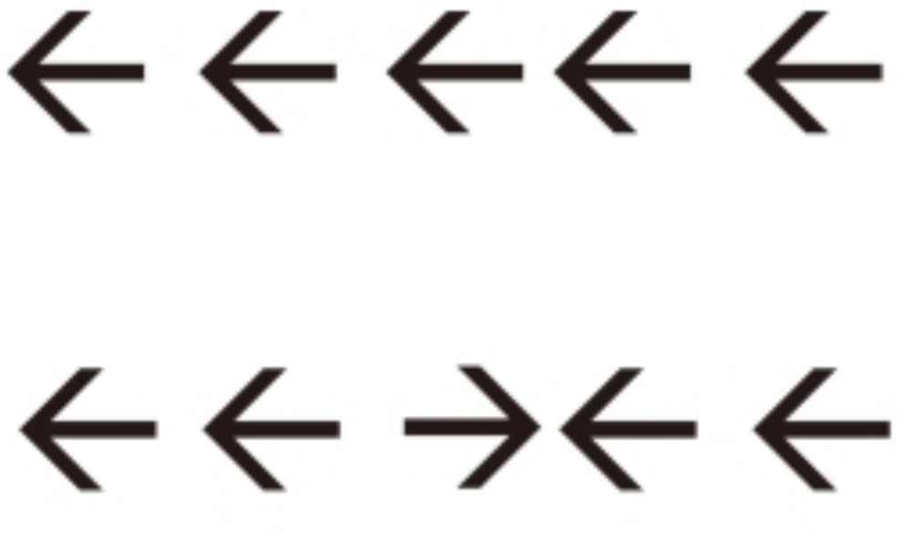
```

---

## Cognitive control tasks

### Global/local task

```{r, echo=FALSE, fig.align='center',out.width="50%", fig.cap=""}
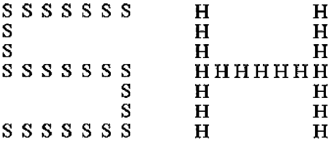
```

```{r, echo=FALSE, fig.align='center',out.width="50%", fig.cap="Andres and Fernandes, 2006"}
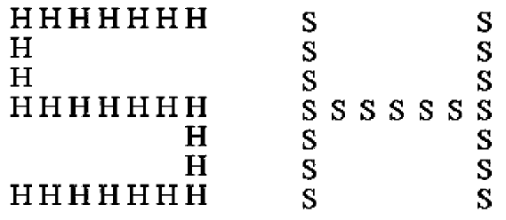
```

---

## Cognitive control tasks

### Simon task

```{r, echo=FALSE, fig.align='center',out.width="95%", fig.cap="Kharitonova et al. (2013)"}
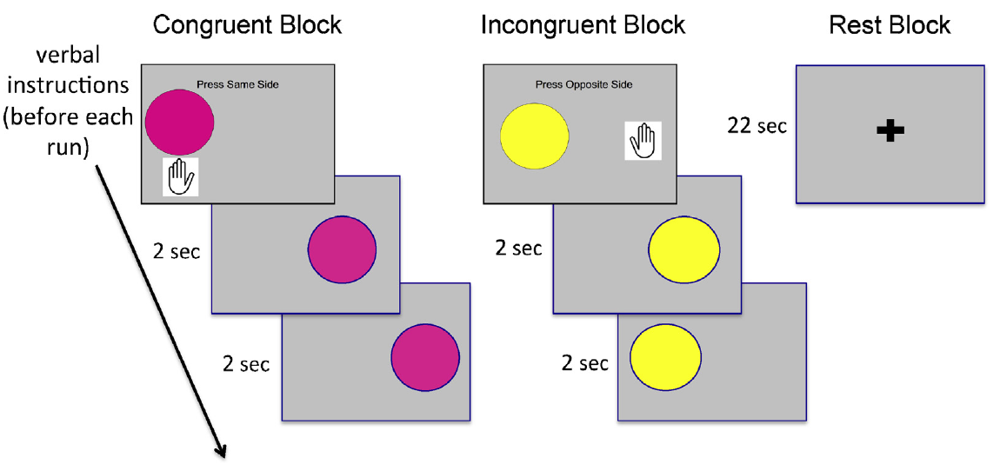
```

---

## Cognitive control tasks

### Antisaccade

```{r, echo=FALSE, fig.align='center',out.width="50%", fig.cap="Everling and Fischer (1998)"}
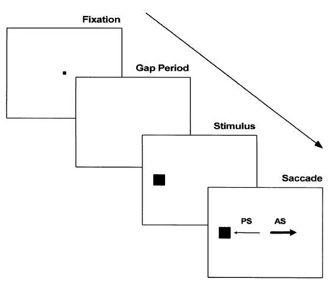
```

---

## Cognitive control tasks


Common elements...

--

<br>

- Distinction between “congruent” and "incongruent" trials. 

--

<br>

- The core assumption is that participants should take longer to respond to incongruent trials.

--

<br>

- Cognitive control is measured in terms of differences in response times (RT) observed across conditions following **Donders' subtraction method**

--

<br>

- Data cleaning often involves removing extreme RTs and trials where an error was made. 


---

## Donders' subtraction method (1868)

--

- Mental processes do not occur simultaneously. 

--

- Distinctive mental processes can be isolated by subtracting the **mean response time** observed across different conditions.

<br>

--

```{r, echo=FALSE, fig.align='center',out.width="75%", fig.cap=""}
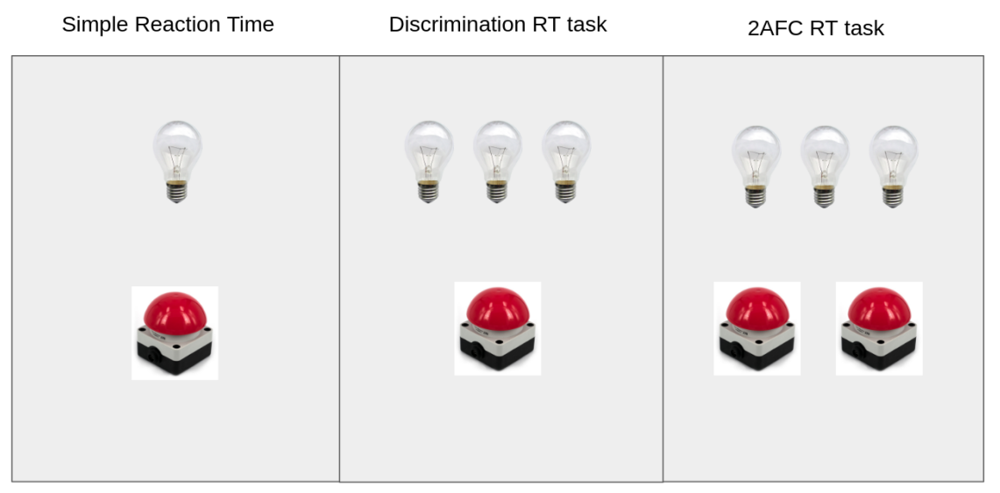
```

---

## Individual differences in cognitive control

<br>

<br>

- What can we learn about one person's cognitive control from any given cognitive control task?

<br>

--

- Can we predict performance on task B from the score observed on task A?

<br>

--

<br>

- What are the **individual differences in cognitive control**?


---

## Individual differences in cognitive control

```{r, echo=FALSE}
load(file = "../RData/reyRTDiff.RData")
load(file= "../RData/reyGSpeed.RData")
corDiff <- myCorr(diff)
```

<p align="right"> (Rey-Mermet et al., 2019) </p>

```{r, echo=FALSE, fig.align='center', fig.width=7}
corrplot(corDiff, method = "color", order="hclust") #Corrplot
```

---

```{r, echo=FALSE, include=FALSE, results='hide'}
source(file = "../RData/readData.R")

###################################
###########      Von Bastian's Data
# Load data
vonBastian_stroop <- readVbStroop()
vonBastian_stroop$task <- "Stroop"
vonBastian_simon <- readVbSimon()
vonBastian_simon$task <- "Simon"
vonBastian_flnkr <- readVbFlanker()
vonBastian_flnkr$task <- "Flanker"
# Merge data
vonBastian <- rbind(vonBastian_stroop,vonBastian_flnkr, vonBastian_simon)
# Mean RT per condition
vonBastian_meanRTperCond <- tapply(vonBastian$rt,list(vonBastian$sub,vonBastian$task,vonBastian$cond), mean)
# Difference scores
vonBastian_diff <- vonBastian_meanRTperCond[,,2]-vonBastian_meanRTperCond[,,1]
# General Speed
vonBastian_gSpeed <- tapply(vonBastian$rt,list(vonBastian$sub,vonBastian$task), mean)


###################################
###########      Pratte's data
# Load data
pratte_stroop1 <- readPratteStroopI()
pratte_stroop1$task <- "Stroop"
pratte_stroop2 <- readPratteStroopII()
pratte_stroop2$task <- "Stroop"
pratte_simon1 <- readPratteSimonI()
pratte_simon1$task <- "Simon"
pratte_simon2 <- readPratteSimonII()
pratte_simon2$task <- "Simon"
# Merge data sets
pratte1 <- rbind(pratte_stroop1, pratte_simon1)
pratte1$rt <- pratte1$rt/10
pratte2 <- rbind(pratte_stroop2, pratte_simon2)
pratte2$rt <- pratte2$rt/10
# Mean RT per condition
pratte1_meanRTperCond <- tapply(pratte1$rt,list(pratte1$sub,pratte1$task,pratte1$cond), mean)
pratte2_meanRTperCond <- tapply(pratte2$rt,list(pratte2$sub,pratte2$task,pratte2$cond), mean)
# Difference scores per experiment
pratte1_diff <- pratte1_meanRTperCond[,,2] - pratte1_meanRTperCond[,,1]
pratte2_diff <- pratte2_meanRTperCond[,,2] - pratte2_meanRTperCond[,,1]
# General Speed per experiment
pratte1_gSpeed <- tapply(pratte1$rt,list(pratte1$sub,pratte1$task), mean)
pratte2_gSpeed <- tapply(pratte2$rt,list(pratte2$sub,pratte2$task), mean)


x <- tapply(pratte1$rt,list(pratte1$sub,pratte1$task),length)

###################################
###########      Whitehead's data
white1 <- cleanWhitehead1()
white1_meanRTperCond <- tapply(white1$rt,list(white1$sub,white1$task,white1$cond), mean)
white1_diff <- white1_meanRTperCond[,,2]-white1_meanRTperCond[,,1]
white1_gSpeed <- tapply(white1$rt,list(white1$sub,white1$task), mean)

white2 <- cleanWhitehead2()
white2_meanRTperCond <- tapply(white2$rt,list(white2$sub,white2$task,white2$cond), mean)
white2_diff <- white2_meanRTperCond[,,2]-white2_meanRTperCond[,,1]
white2_gSpeed <- tapply(white2$rt,list(white2$sub,white2$task), mean)

white3 <- cleanWhitehead3()
white3_meanRTperCond <- tapply(white3$rt,list(white3$sub,white3$task,white3$cond), mean)
white3_diff <- white3_meanRTperCond[,,2]-white3_meanRTperCond[,,1]
white3_gSpeed <- tapply(white3$rt,list(white3$sub,white3$task), mean)

source(file = "../RData/fun_readData.R")
reyM <- loadData.ReyMermet("../RData/")

length(unique(reyM$task))
length(unique(reyM$subj))
x <- tapply(reyM$rt,list(reyM$subj,reyM$task),length)
apply(x,2,median)

enkavi <- loadData.EnkaviPoldrack("../RData/")

```

## Individual differences in cognitive control


```{r, echo=FALSE, fig.align='center'}
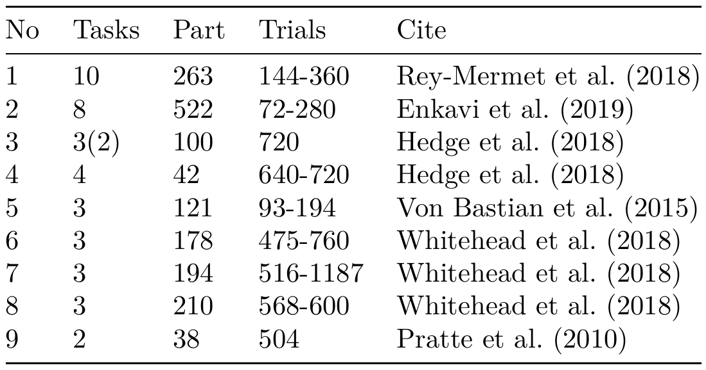
```

---

## Individual differences in cognitive control

```{r, echo=FALSE, fig.align='center'}
par(mfrow = c(3, 3), omi=c(0,0,0,0))
  
#colnames(diff) <- c("Glb","n2RC","nmSt","ltF","arF","pstvC","lcl","smn","clSt","ngtvC")
colnames(diff) <- paste("J",c(1:ncol(diff)),sep="")
corDiff <- myCorr(diff)
corrplot(corDiff, method = "color", order="hclust",tl.col = "blue4",cl.length = 2) #Corrplot
#mtext("Data set 1",2,line=1.2, f=2,cex=1)

load(file="../RData/poldrackDiffMeans.RData")
#colnames(DiffMeans) <- c("RP","SM","Sm","St","AN","DF","LG","RfP")
#colnames(DiffMeans) <- c("RecentProbes","ShapeMatching","Simon","Stroop","AttentionalNetwork","DirectedForgetting","LocalGlobal","RefractoryPeriod")
colnames(DiffMeans) <- paste("J",c(1:ncol(DiffMeans)),sep="")
corDiff <- myCorr(DiffMeans)
corrplot(corDiff, method = "color", order="hclust",tl.col = "blue4",cl.length = 2) #Corrplot
#mtext("Data set 2",2,line=1.2, f=2,cex=1)

load(file="../RData/hedgDiff-1y2_1app.RData")
datos <- diff1y2_1app
#colnames(datos) <- c("F","St")
colnames(datos) <- paste("J",c(1:ncol(datos)),sep="")
corrplot(myCorr(datos), method = "color", order="hclust",tl.col = "blue4",
         col.lim = c(0,1),cl.length = 2) #Corrplot
#mtext("Data set 3",2,line=1.2, f=2,cex=1)

load(file = "../RData/hedgDiff-3_1app.RData")
datos <- diff3_1app
#colnames(datos) <- c("G","L","P","SNA")
colnames(datos) <- paste("J",c(1:ncol(datos)),sep="")
corDiff <- myCorr(datos)
corrplot(corDiff, method = "color", order="hclust",tl.col = "blue4",cl.length = 2) #Corrplot
#mtext("Data set 4",2,line=1.2, f=2,cex=1)

datos <- vonBastian_diff
colnames(datos) <- paste("J",c(1:ncol(datos)),sep="")
corrplot(myCorr(datos), method = "color", order="hclust",tl.col = "blue4",
         col.lim = c(-1,1),cl.length = 2) #Corrplot
#mtext("Data set 5",2,line=1.2, f=2,cex=1)

datos <- white1_diff
#colnames(datos) <- c("F","St","Sm")
colnames(datos) <- paste("J",c(1:ncol(datos)),sep="")
corrplot(myCorr(datos), method = "color", order="hclust",tl.col = "blue4",
         col.lim = c(-1,1),cl.length = 2) #Corrplot
#mtext("Data set 6",2,line=1.2, f=2,cex=1)

datos <- white2_diff
#colnames(datos) <- c("F","St","Sm")
colnames(datos) <- paste("J",c(1:ncol(datos)),sep="")
corrplot(myCorr(datos), method = "color", order="hclust",tl.col = "blue4",
         col.lim = c(-1,1),cl.length = 2) #Corrplot
#mtext("Data set 7",2,line=1.2, f=2,cex=1)

datos <- white3_diff
#colnames(datos) <- c("F","St","Sm")
colnames(datos) <- paste("J",c(1:ncol(datos)),sep="")
corrplot(myCorr(datos), method = "color", order="hclust",tl.col = "blue4",
         col.lim = c(-1,1),cl.length = 2) #Corrplot
#mtext("Data set 8",2,line=1.2, f=2,cex=1)

datos <- pratte1_diff
colnames(datos) <- paste("J",c(1:ncol(datos)),sep="")
corrplot(myCorr(datos), method = "color", order="hclust",tl.col = "blue4",
         col.lim = c(-1,1),cl.length = 2) #Corrplot
#Smtext("Data set 9",2,line=1.2, f=2,cex=1)
```

---

## Big debate: What do these low correlation imply?

--

<br>

<br>

**1.- A substantive problem:** Is cognitive control a cognitive process that can be studied as an individual trait or not?

--

<br>

<br>

**2.- A measurement challenge:** Does it make sense to use difference scores to study individual differences in cognitive control?

---

## The measurement challenge

--

<br>

Correlational studies are conducted to capture individual differences in a given trait of interest under two core assumptions:

--

<br>

- 1) We are using scores related to the same process or to different components of a unitarian process. 

--

- 2) We are using scores that provide reliable information. 

--

<br>

<br>

**Task-specific difference scores need to be highly reliable.**


---

## Reliability of difference scores


<br>

$$\Huge \rho_{dd'} = \frac{\rho_{xx'}-\rho_{xy}}{1-\rho_{xy}}$$

<p align="right"> Lord (1963), cited by Draheim et al. (2019) </p>

--

<br>

Let's assume...

--

...Individual components have perfect reliability ( $\large \rho_{xx'}=1$ )

--

...Individual components are independent from each other ( $\large \rho_{xy}=0$ )


---

## Reliability of difference scores

<br>

--

- Hedge et al. (2018) conducted three test-retest studies. The most reliable cognitive control task was found to be the Stroop task ( $0.60 - 0.66$ )

--

<br>

- Enkavi et al. (2019) summarize reliability indices reported in the literature, which were found to be highly variable (i.e., the Stroop task  varied between 0.27 and 0.8, and the Simon task, oscillated between the whole $0-1$ interval). 


---


## Reliability of difference scores

--

<br>

- High correlations between incongruent and congruent RT are expected.

--

<br>

- It is expected to have shared systematic variance across incongruent and congruent RTs.

--

<br>

- Subtracting one of them from the other removes the systematic variance, leaving only the error variance.

---

## Factorial structure of overall RT

**Rey-Mermet et al., 2019**

```{r, echo=FALSE, fig.align='center', fig.height=6.5, fig.width=10}
pcaRes <- prcomp(na.omit(gSpeed), center=TRUE, scale = TRUE)
a<- summary(pcaRes)
b<- fviz_eig(pcaRes,main="General speed",choice="variance",addlabels = TRUE)
c<- fviz_pca_var(pcaRes, axes = c(1, 2), 
                 repel = T)+theme_classic(base_size = 11)
b
```

---

## Factorial structure of difference scores

**Rey-Mermet et al., 2019**

```{r, echo=FALSE, fig.align='center', fig.height=6.5, fig.width=10}
pcaRes <- prcomp(na.omit(diff), center=TRUE, scale = TRUE)
a<- summary(pcaRes)
b<- fviz_eig(pcaRes,main="Difference scores",choice="variance", addlabels = TRUE)
c<- fviz_pca_var(pcaRes, axes = c(1, 2), 
                 repel = T)+theme_classic(base_size = 11)
b
```

---

## Arguments against difference scores

--

- “Differences between scores are much more unreliable than the scores themselves” (Lord, 1956).

<br>

- “Scores formed by subtracting pretest scores from postest scores lead to fallacious conclusions, primarily because such scores are systematically related to any random error of measurement” (Cronbach and Furby, 1970)

<br>

- “Difference scores have low convergent validity caused by deficiencies in test-retest reliability” (Paap & Sawi, 2016)

<br>

--

**Overall:** Difference scores are particularly problematic for differential research.

---

## What are the alternatives?

--
<br>

- 1) Switching to accuracy metrics.


--

<br>

<br>

- 2) To develop a new metric that incorporates accuracy and RTs.

--

<br>

<br>

- 3) A different modeling approach...

---

class: middle, center

# 3. Response time modeling

---

##  Response time (RT) modeling

--

<br>

- RTs are known to be highly variable.

--

<br>

- The analysis of RT distributions constitutes a long-standing tradition in Psychology (Hohle, 1965; Luce, 1986; Ratcliff, 1978)


--

<br>

- Specific characteristics of RT distributions are thought to shed light on the psychological processes that underlie the behavior observed. 

---

## The Worst performance rule

--

<br>

- Slowest RTs are more indicative of general intelligence than the faster RTs (Larson & Alderton, 1990).

--

<br>

- When individual RTs are ranked and grouped into RT bands, the median slowest RTs correlate better with measures of general intelligence, working memory and processing speed than the fastest median RTs (Coyle, 2003). 

--

<br>

- Point estimates such as the mean or median RT neglects the RT variability observed. 


---


## Two types of RT models

--

<br>

**1.- Simple RT models**

Mathematical models that describe empirical RT distributions and whose quantitative properties (i.e., shift, scale and shape parameters) can be mapped to specific experimental manipulations (Andrews & Heathcote, 2001; Heathcote et al., 1991; Hockley, 1984; Hohle, 1965; Spieler et al., 2000). 

--

<br>

**2.- Choice RT models**

- RTs are conceived as the stopping point of an internal processes generating the choices observed, (Noorani & Carpenter, 2016), and as such, RTs are modeled jointly with the choices observed.

---

## Simple RT models: the exGaussian distribution

```{r, echo=FALSE, warning=FALSE, message=FALSE, fig.align='center', fig.width=10}
library(gamlss.dist)

layout(matrix(c(1,2,3,3), 2, 2, byrow = TRUE))

tau <- 4
mu <- 3
sigma <- 0.8

x <- seq(-10,20,0.01)
plot(x,dexp(x,tau),type="l", xlim=c(0,6), 
     ann=F, axes=F, col="forestgreen", lwd=4)
axis(1,seq(0,20,0.5))
text(3, 3, col="darkgreen", cex=1.8,
     expression(paste("Y ~ Exponential(",tau,")")))
plot(x,dnorm(x,mu,sigma),type="l", xlim = c(-2,6), 
     ann=F, axes=F, col="purple2",lwd=4)
axis(1,seq(-2,20,0.5))
text(0, 0.4, col="purple4", cex=1.8,
     expression(paste("X ~ Normal(",mu,",",sigma,")")))
plot(x,dexGAUS(x,mu,sigma,tau),type="l", xlim = c(0,20), 
     ann=F, axes=F, col="orange2", lwd=4)
axis(1,seq(0,20,0.5))
text(12, 0.12, col="darkorange3", cex=1.8,
     expression(paste("Y+X ~ exGaussian(",mu,",",sigma,",",tau,")")))
```

---

## Simple RT models: the exGaussian distribution

<br>

- The exGaussian distribution has proven suitable to model empirical RT distributions (Heathcote et al., 1991; Hockley, 1984; Mewhort et al., 1992; Ratcliff, 1979).

--

- Parameters related to the normal component have been associated with peripheral sensory–motor and automatic processes

--

- The exponential component has been found to be related to decision-related processes (Hohle, 1965; Gordon & Carson, 1990; Rohrer & Wixted, 1994). 

--

- The exGaussian parameters have also been mapped to drift diffusion model parameters (e.g., faster drift rates are associated with smaller rates, while more conservative response criteria are linked with larger values of $\mu$ ; Spieler, 2001; Schmiedek et al., 2007).

---

## Simple RT models: the logNormal distribution


---

## Choice RT models

--

<br>

“...most real-life decisions are composed of two separate decisions: first the decision to stop deliberating and act, and then the decision or act itself”.

<p align="right"> Forstmann et al. (2016) </p>

--

<br>

- Sequential sampling models account for the speed-accuracy tradeoff observed (Stone, 1960; Ratcliff & Smith, 2004).

--

<br>

- These sampling models assume that evidence for any response alternative is accumulated over time until a response threshold is reached.

--

<br>

- They account jointly for the responses and RTs observed.

---

### LATER model (Carpenter, 1981)

<br>

- The linear approach to threshold with ergodic rate (LATER) model considers only **two free parameters**.

<br>

- Founded on the empirical finding that the inverse of the RTs follow a normal distribution (with parameters $\mu$ and $\sigma$ ). 

<br>

- Non-decision time is assumed to be fixed and is otherwise not considered by this model.

---

### LATER model components

--

- Every stimuli $S$ has an initial value $S_0$

--

- Internal process progresses linearly with constant rate $r$, which varies across trials following a normal distribution.

--

- Response is initiated when a threshold $S_T=S_0 + \theta$ is met

--

- RTs observed are given by $T=\frac{\theta}{r}$

--

- Since $r \sim \mbox{Normal}(\mu, \sigma)$, then $\frac{1}{T}$ is also normally distributed, thus replicating the empirically reported pattern.

---

### LATER model

```{r, echo=FALSE, fig.align='center',out.width="90%", fig.cap="Noorani and Carpenter, 2016"}
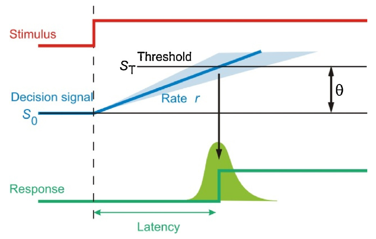
```

---

### Linear ballistic accumulation model (Brown & Heathcote, 2008)

<br>

- An extension of the LATER model that incorporates a parameter to capture non-decision time.

--

<br>

- The accumulation rate is now referred to as drift rate, $d$.

--

<br>

- Each response alternative is assumed to have its own independent accumulator.

--

<br>

- The response observed corresponds to the first accumulator to reach the threshold value $b$. 

--

<br>

- The starting point per accumulator is assumed to vary across trials following a uniform distribution with bounds 0 and $a$ (such that $a < b$)

---

### Linear ballistic accumulation model (Brown & Heathcote, 2008)

<br>

```{r, echo=FALSE, fig.align='center',out.width="98%", fig.cap="Brown and Heathcote, 2008"}
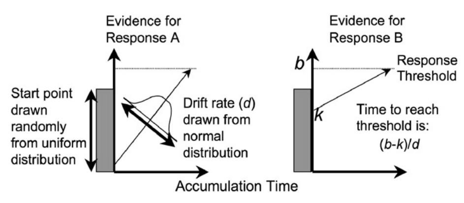
```

---


### Drift diffusion model (Ratcliff, 1978)

```{r, echo=FALSE, fig.align='center',out.width="90%", fig.cap="Johnson et al., 2017"}
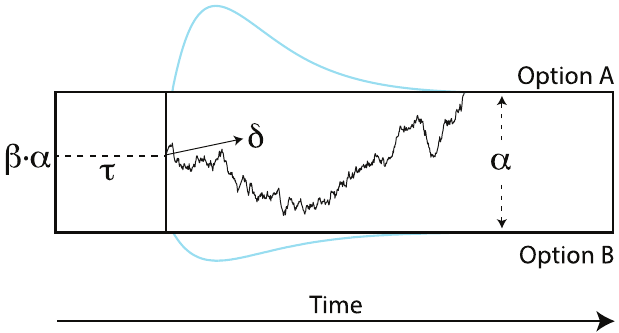
```

---

### Circular drift diffusion model (Smith, 2016)

```{r, echo=FALSE, fig.align='center',out.width="80%"}
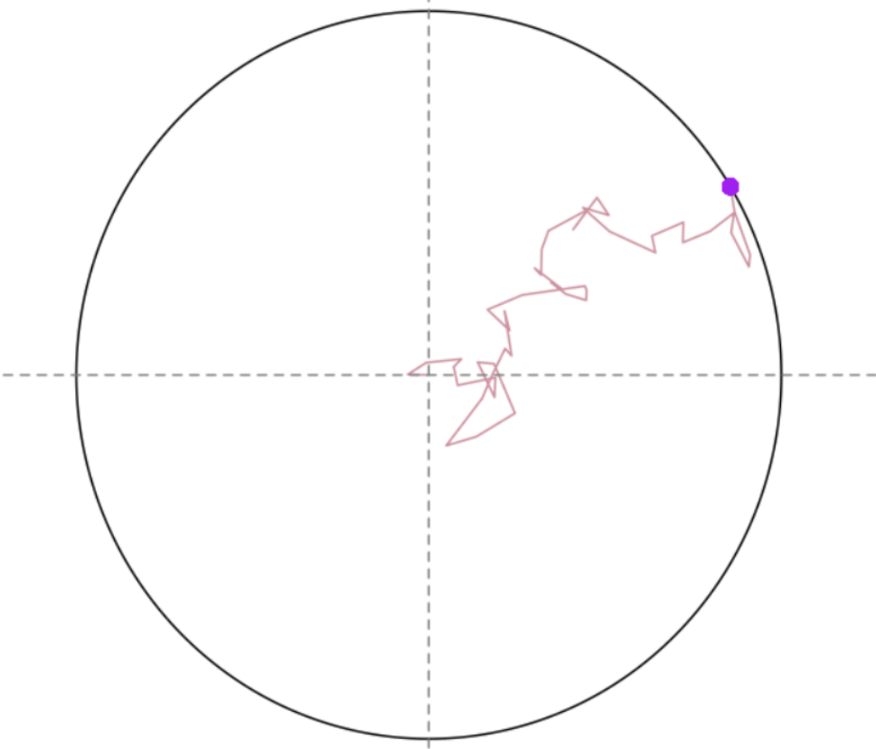
```


---

class: middle, center

# 4. Cognitive latent variable modeling of response times

---

## Latent variable models and psychometrics

The models described in previous chapters are identified as cognitive models because they account for the psychological processes that underlie the data observed. In contrast, psychometric models, or LVMs, constitute a type of model that assumes that the data observed results from the linear combination of a small number of latent variables that vary across different random levels (i.e., across participants, conditions, tasks, etc.) and some measurement error (Baribault, 2019). 

LVMs are used to identify the components that can account for the data observed and their different levels of variation. This type of model allows us to determine whether variability in the data can be attributed to differences between participants or to the effect of specific features of the experimental design (i.e., experimental conditions, stimuli characteristics, levels of an experimental manipulation, etc.). 

An important difference between cognitive models and LVMs is that the latter do not assume that every latent variable associated with the data has a relevant psychological interpretation. LVMs are often implemented with the goal of identifying the smallest number of substantially relevant latent components that can be used to account for the majority of the variability contained in the data (Bollen, 2002).

---

## Cognitive psychometrics and individual differences

We use the term cognitive psychometrics to refer to the psychometric treatment of cognitive models (Batchelder, 1998; Batchelder, 2010) with the intention of identifying whether the cognitive processes described by cognitive models vary across participants, items, conditions, tasks, and so on. For example, clinical researchers aim to identify how individuals from different populations may vary in terms of the parameter values estimated from cognitive models used to account for their performance in cognitive tasks, and how these changes may be elicited over time or across conditions.

Using LVM techniques onto parameters associated with a cognitive model presents a reconciliation point among experimental and differential research (Cronbach, 1957; Borsboom, 2006). The main advantage of cognitive psychometrics is that it preserves the best of both worlds: First, parameters derived from cognitive models are known to be informative of the cognitive processes underlying behavior and thus are highly interpretable. Second, we move away from the use of aggregated data to recognize the richness of the information provided by the data variability, considering differences in performance across many possible levels of random variation (Riefer et al., 2002).

As an example of the application of the cognitive psychometrics approach, we discuss the study conducted by Schmiedek et al. (2007). In this study, eight different choice response time tasks were applied along with six tasks used to measure working memory and intelligence. From the data collected, an exGaussian model was fit to the RT data and parameters of the DDM were estimated using both RTs and choice data. Then, the authors performed confirmatory factorial analysis techniques on all parameter values obtained, and report that individual differences in the rate parameter of the exGaussian distribution (i.e., ) were found to be a unique predictor for the individual differences in the performance observed across the different working memory and reasoning tasks included in the study. Along these lines, we can also find studies on the latent variable structure of cognitive control from the perspective of cognitive psychometrics (Miyake et al., 2000; Friedman and Miyake, 2004).

---

## Cognitive latent variable models 

The joint approach postulated by cognitive psychometrics allows researchers to make conclusions far more informative than either a cognitive model or an LVM could afford separately. LVMs are regarded as informative of the internal structure of the data, but these types of models provide very limited insights into the underlying processes and mechanisms that could be generating the data, while cognitive models are limited in their ability to identify higher-order latent structures. 

Despite the advantages presented by cognitive psychometrics in terms of the enhanced insights we can gain from the data collected about the underlying processes of interest, the applications described in the previous section present some major limitations. The studies conducted by Friedman and Miyake in 2004 and by Schmiedek et al. in 2007 consist of a two-step application of the joint modeling technique postulated by the cognitive psychometrics approach. Both studies perform the parameter estimation from the cognitive model of interest first, and then in a second step, they use latent variable modeling techniques to describe the latent variable structure of these parameter values. This two-step approach is limited because the variability contained in the data is only used to inform the parameter estimation, but it is neglected in the identification of their latent variable structure. Thus, the latent variable structure revealed in the second step considers only the variability in the parameter values recovered, while ignoring the uncertainty contained in the raw data.

As an alternative, Vandekerckhove (2014) introduced CLVMs as a class of models that explore the latent variable structure of the parameters of cognitive models, all as part of a hierarchical Bayesian model. As an illustrative example, the author presents a CLVM that uses the DDM as the main cognitive model, such that by imposing a latent variable model to describe the parameters of the DDM we are now able to draw substantive conclusions about the latent variables that could be explaining the differences observed in processing speed, response caution, and son on, that are made evident if we simply compare the parameter values recovered across different possible levels of variation.

CLVMs allow to make inferences about the unobserved cognitive processes generating the data collected in terms of the influence of many unobserved latent variables. A key feature of CLVM is that both the cognitive model parameters and their latent variable structure is being inferred as part of a single hierarchical Bayesian model. This feature comes with the huge advantage that the uncertainty contained in the data is captured and allocated across both model components (Vandekerckhove, 2014; Baribault, 2019). 


---

class: middle, center

# 5. Research proposals

---

## 1) Exploring the unidimensionality of processing speed

<br>

**Goal:** Explore the dimensionality of processing speed in extended data sets, in contrast with the dimensionality of human anthropometrics.

<br>

- Perform a PCA over the processing speed observed across different tasks.

<br>

- Perform a PCA over a large anthropometric dataset.

---

## 2) exGaussian CLVM

<br>

**Goal:** To explore the unidimensional structure of processing speed across cognitive control tasks through the lens of RT distribution analysis. 

<br>

- Determine whether this univariance can be tracked back to the shift, scale, or shape parameters of the RT distribution. 

---

## 3) Categorical drift-diffusion model

<br>

*Goal:* To develop extension of the CDDM where the bounded continuous decision space is segmented into bins.

<br>

- Develop a JAGS module.

<br>

- Present a paremet recovery study.

<br>

- Show an application to real-world data.

---

# IN SUMMARY

--

1.- The study of individual differences depends on high between-subject variability.

--

2.- Individual differences in cognitive control have been mostly approximated through task-derived dependent measures.

--

3.- Response Time distribution analysis presents an alternative to the use of task-derived dependent measures.

--

4.- We can implement cognitive latent variable models that capture the latent structure of the parameters of a given RT model.

---


class: middle, center

# Thank you! 